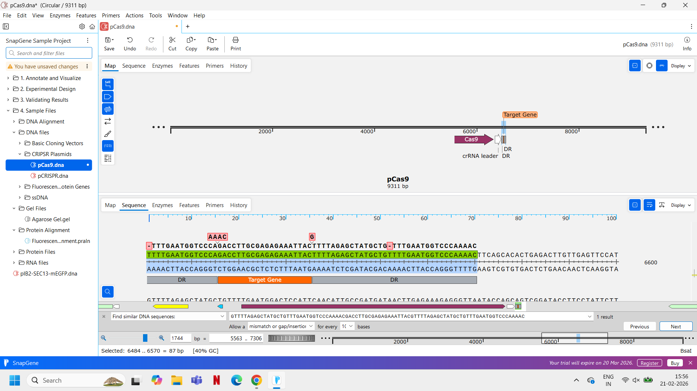

# CRISPR_Colours
Studying CRISPR through analysis of gene editing effects in host (bacterial+ human) genomes.
# CRISPR Colours: Automated E. coli Targeting 🧬

This project uses Python to automate the design of CRISPR-Cas9 gRNA sequences to target essential genes in *E. coli* (specifically `gyrA`).

## 🚀 Workflow
1. **Search:** Scans the gene for NGG PAM sites.
2. **Design:** Generates Top and Bottom oligos with BsaI overhangs.
3. **Verify:** Checks stability ($T_m$) and simulates the final plasmid.

## ✅ Verification
The design was verified in **SnapGene** to ensure the spacer sits correctly between the Direct Repeats (DR) on the Sense strand.

## 📊 Final Report
The automated [Design Report](./design_report.txt) provides the melting temperature and oligo sequences for lab synthesis.
